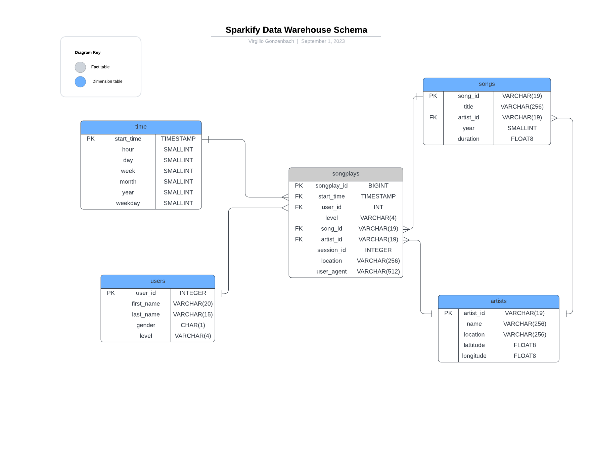

# Redshift ELT example

This project contains an ELT pipeline that configures an AWS Redshift cluster and loads into it data from S3. The data being loaded is a subset from the One Million Song dataset and is publicly available at `s3://udacity-dend`

## File Descriptions

Here's a brief description of the files in this project

```{sh}
├── dwh.cfg                   # Configuration file for Redshift cluster and other settings
├── erd.png                   # Entity-Relationship Diagram of the database
├── iam_user_policy.json      # Example IAM policy for necessary AWS permissions
├── pipeline                  # Main codebase for the ETL pipeline
│   ├── create_tables.py      # Script to create the tables in Redshift
│   ├── elt.py                # Script to run the ELT process
│   ├── helpers               # Helper scripts
│   │   ├── aws_credentials.py  # Script to manage AWS credentials
│   │   ├── examine_s3_json.sh  # Shell script to examine JSON files in S3
│   │   └── logger_cfg.py     # Configuration for logging
│   ├── setup_redshift.py     # Script to setup Redshift cluster
│   └── sql_queries.py        # SQL queries used in the ETL process
├── requirements.txt          # Required Python packages
└── run.sh                    # Shell script to run the entire pipeline
```

## Installation

Python 3 is needed for running the workflows. 

```{sh}
git clone https://github.com/vgonzenbach/redshift_elt
cd redshift_elt
python -m venv .venv # set up environment
.venv/bin/pip install -r requirements.txt # to install required packages in environment
```

## Requirements

Python and pip are required to run this pipeline, as well AWS access keys and IAM user with appropriate policy for Redshift, S3, IAM, EC2. An example
IAM policy has been provided in `iam_user_policy.json`, which can be set up in the AWS IAM console prior to running the pipeline. 

## Usage

Fill out `dwh.cfg` with the desired cluster configurations. The fields `host` under `[CLUSTER]` and `arn` under `[IAM_ROLE]` will be populated by the program, but if you have already set up a cluster, fill in the relevant information in these fields. Also, note that `profile` under `[AWS]` is set to `default` to use the default access keys in `~/.aws/credentials`. If AWS keys are saved in a location other than `~/.aws/credentials` then this path can be edited in `aws_credentals.py`.

The main entry point to run the pipeline is

```{sh}
bash run.sh
```

Once the pipeline has been run, the redshift cluster will accept queries. Here's the star schema to guide analytical work:



